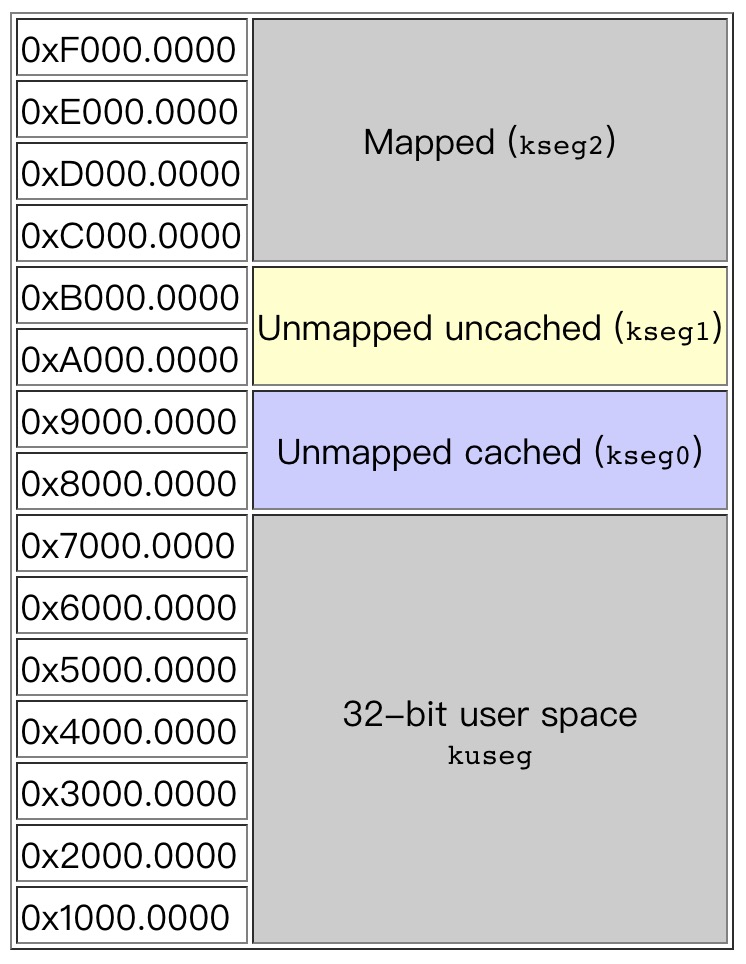

# 内存管理

内存管理的硬件部分已经写好了，我们只需要实现软件部分。  
硬件部分的功能有：TLB、虚拟地址到物理地址的映射。  
通过 CP0 寄存器来控制内核态/用户态，也可以进行其他操作。具体参考《MicroAptiv UP Software User's Manual MD00942》

boot 中的 Makefile 指明，启动代码和用户代码被放到了内存中的两个不同的位置，有很大迹象表明内存空间可以自行分配。
```makefile
# Place the boot code (physical address). The virtual address for
# boot code entry point is hard-wired to 0x9fc00000.
LDFLAGS += -Wl,--defsym,__flash_start=0xbfc00000
# Place the application code (physical address)
LDFLAGS += -Wl,--defsym,__flash_app_start=0x80000000
```

内存空间应使用页式管理，通过查询资料得到，首先需要[探测系统物理内存布局](https://chyyuu.gitbooks.io/ucore_os_docs/content/lab2/lab2_3_3_2_search_phymem_layout.html)，其次才是[以页为单位管理物理内存](https://chyyuu.gitbooks.io/ucore_os_docs/content/lab2/lab2_3_3_3_phymem_pagelevel.html)，其中需要定义 Page 数据结构、维护空闲空间链表，提供初始化、分配内存与释放内存的接口。

## 物理内存探测

RAM0 中存放的是引导代码（虚拟地址 0xbfc00000-0xbfc1fffc = 物理地址 0x1fc00000 - 0x1fc1fffc），RAM1 中存放的是用户代码（虚拟地址 0x80000000 - 0x8003fffc = 物理地址 0x00000000 - 0x0003fffc）。

## 堆栈

> 《MIPS 体系结构与编程》 刘佩林 P174

MIPS 硬件不直接支持对战结构，但是 C 语言语法却使用了堆栈，所以需要弄明白 MIPS 是如何利用处理器和存储器资源来实现堆栈的。

## 用户态与内核态

> [mips的内存管理-kseg0,kseg1虚拟和物理地址映射理解](http://blog.chinaunix.net/uid-20564848-id-74683.html)

1. MIPS 复位和中断发生的时候会自动进入内核态  
2. 在用户态下，向虚拟地址 0x80000000 ~ 0xffffffff 写入数据会抛出异常  
3. unmapped 存储器段在虚拟地址到物理地址转换时不会用到 TLB  
4. 在复位以后，拥有 unmapped 存储器段是非常重要的，因为此时 TLB 还未编程使用  
5. unmapped 存储器段有一种非常简单的方式可以实现虚拟地址到物理地址的转换  
6. mapped 存储器段在进行虚拟地址到物理地址转换时会用到 TLB
7. 没有实模式，这是 MIPS CPU 的一个很重要的特点


<!--  -->


8. 在加电时，只有 kseg0 和 kseg1 是可以存取的，在 MMU 和 TLB 初始化以后可以存取剩余部分。
9. MIPS 的 CPU 有三个态：用户态、内核态和调试态。在用户态下，CPU 只能访问到 kuseg 段的内存。在访问其他段时，CPU 必须处于内核态或调试态下。

## 参考资料

1. [物理内存管理](https://chyyuu.gitbooks.io/ucore_os_docs/content/lab2.html)
2. [Mips Address Space](http://www.johnloomis.org/microchip/pic32/memory/memory.html)
3. [MIPS 存储管理](http://imgtec.eetrend.com/d6-imgtec/article/2014-02/1291.html)